# 实验4：对象管理

## 实验目的：
了解Oracle表和视图的概念，学习使用SQL语句Create Table创建表，学习Select语句插入，修改，删除以及查询数据，学习使用SQL语句创建视图，学习部分存储过程和触发器的使用。
## - 实验场景：
假设有一个生产某个产品的单位，单位接受网上订单进行产品的销售。通过实验模拟这个单位的部分信息：员工表，部门表，订单表，订单详单表。

## 实验内容：
### 删除表和序列
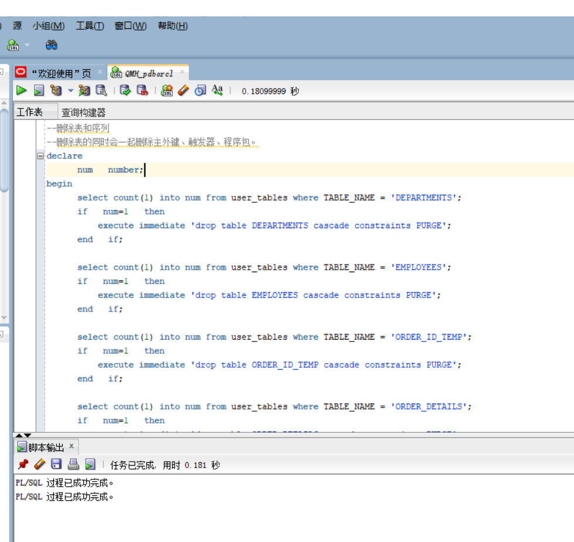
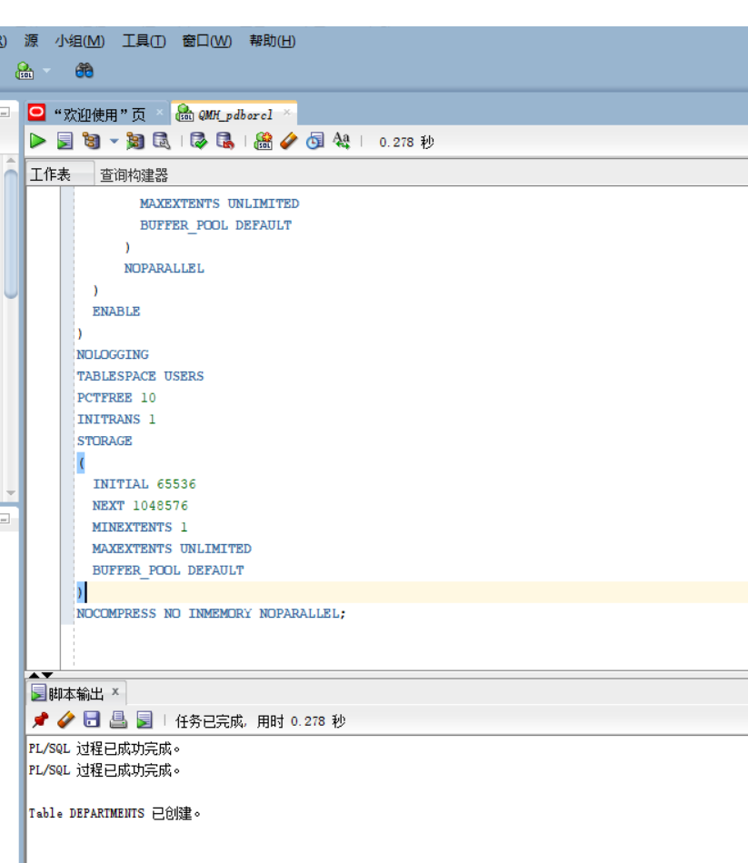
### 创建本地分区索引ORDERS_INDEX_DATE
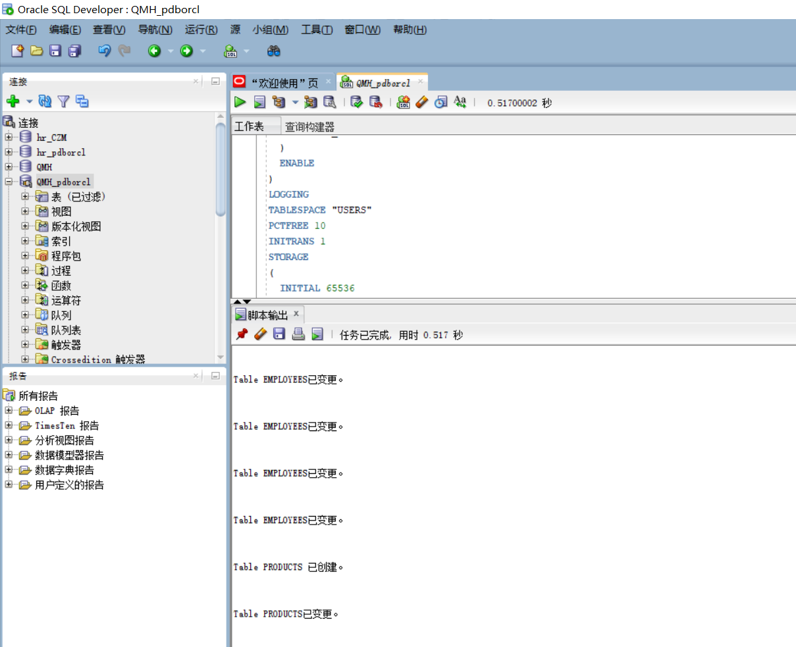

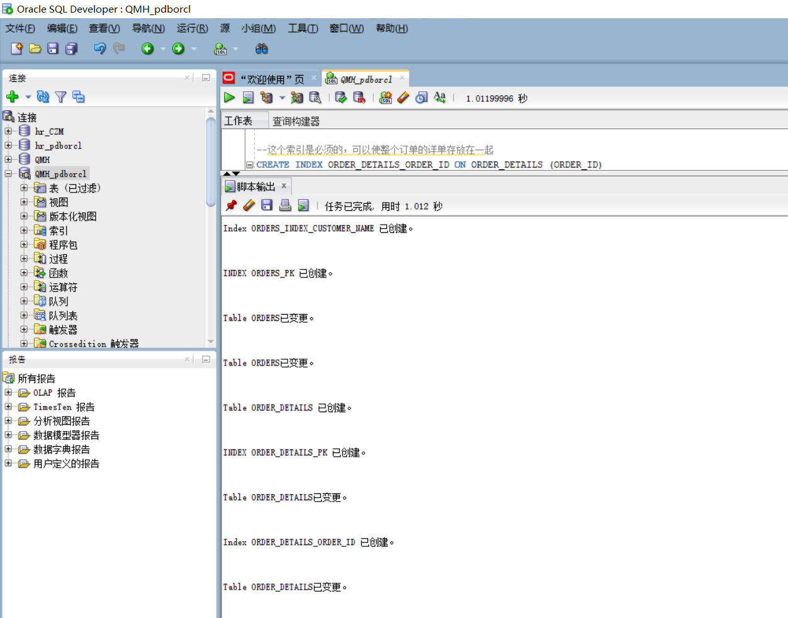
### 创建触发器
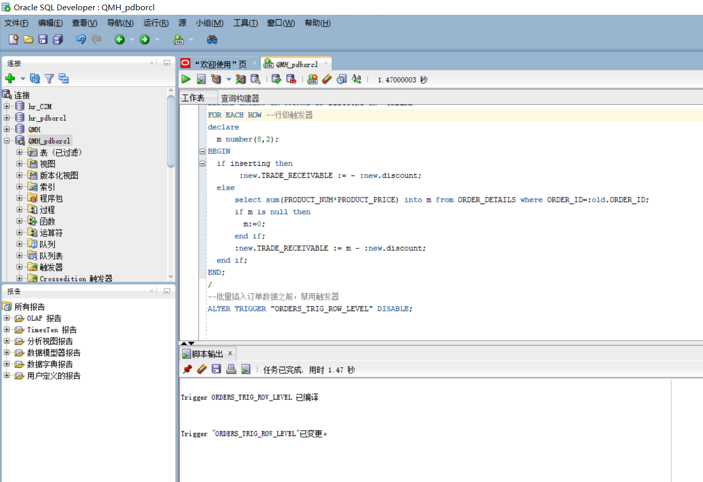

### 录入数据：
要求至少有1万个订单，每个订单至少有4个详单。至少有两个部门，每个部门至少有1个员工，其中只有一个人没有领导，一个领导至少有一个下属，并且它的下属是另一个人的领导（比如A领导B，B领导C）。
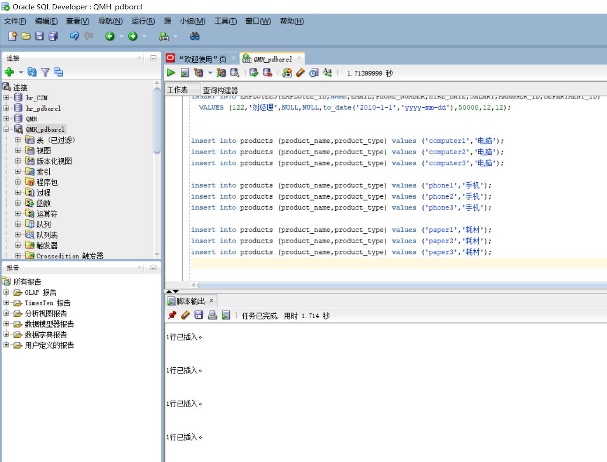
###  序列的应用
插入ORDERS和ORDER_DETAILS 两个表的数据时，主键ORDERS.ORDER_ID, ORDER_DETAILS.ID的值必须通过序列SEQ_ORDER_ID和SEQ_ORDER_ID取得，不能手工输入一个数字。

###  触发器的应用：
维护ORDER_DETAILS的数据时（insert,delete,update）要同步更新ORDERS表订单应收货款ORDERS.Trade_Receivable的值。

###  查询数据：
    1.查询某个员工的信息
    2.递归查询某个员工及其所有下属，子下属员工。
    3.查询订单表，并且包括订单的订单应收货款: Trade_Receivable= sum(订单详单表.ProductNum*订单详单表.ProductPrice)- Discount。
    4.查询订单详表，要求显示订单的客户名称和客户电话，产品类型用汉字描述。
    5.查询出所有空订单，即没有订单详单的订单。
    6.查询部门表，同时显示部门的负责人姓名。
    7.查询部门表，统计每个部门的销售总金额。
select * from ORDERS where  order_id=1;
select * from ORDER_DETAILS where  order_id=1;
select * from VIEW_ORDER_DETAILS where order_id=1;
--2.递归查询某个员工及其所有下属，子下属员工。
WITH A (EMPLOYEE_ID,NAME,EMAIL,PHONE_NUMBER,HIRE_DATE,SALARY,MANAGER_ID,DEPARTMENT_ID) AS
  (SELECT EMPLOYEE_ID,NAME,EMAIL,PHONE_NUMBER,HIRE_DATE,SALARY,MANAGER_ID,DEPARTMENT_ID
    FROM employees WHERE employee_ID = 11
    UNION ALL
  SELECT B.EMPLOYEE_ID,B.NAME,B.EMAIL,B.PHONE_NUMBER,B.HIRE_DATE,B.SALARY,B.MANAGER_ID,B.DEPARTMENT_ID
    FROM A, employees B WHERE A.EMPLOYEE_ID = B.MANAGER_ID)
SELECT * FROM A;
--或者
SELECT * FROM employees START WITH EMPLOYEE_ID = 11 CONNECT BY PRIOR EMPLOYEE_ID = MANAGER_ID;
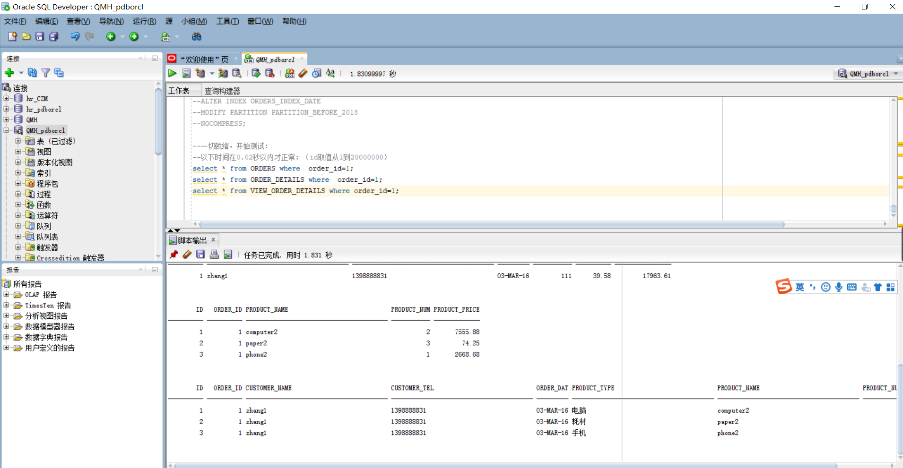
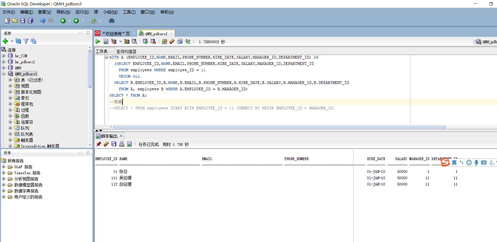

## 表结构

- 部门表DEPARTMENTS,表空间：USERS

|编号|字段名|数据类型|可以为空|注释|
|---|---|---|---|---|
|1|DEPARTMENT_ID|NUMBER(6,0)|NO|部门ID，主键|
|2|DEPARTMENT_NAME|VARCHAR2(40 BYTE)|NO|部门名称，非空|

- 产品表PRODUCTS,表空间：USERS

|编号|字段名|数据类型|可以为空|注释|
|---|---|---|---|---|
|1|PRODUCT_NAME|VARCHAR2(40 BYTE)|NO|产品名称，产品表的主键|
|2|PRODUCT_TYPE|VARCHAR2(40 BYTE)|NO|产品类型，只能取值：耗材,手机,电脑|

- 员工表EMPLOYEES,表空间：USERS

|编号|字段名|数据类型|可以为空|注释|
|---|---|---|---|---|
|1|EMPLOYEE_ID|NUMBER(6,0)|NO|员工ID，员工表的主键。|
|2|NAME|VARCHAR2(40 BYTE)|NO|员工姓名，不能为空，创建不唯一B树索引。|
|3|EMAIL|VARCHAR2(40 BYTE)|YES|电子信箱|
|4|PHONE_NUMBER|VARCHAR2(40 BYTE)|YES|电话|
|5|HIRE_DATE|DATE|NO|雇佣日期|
|6|SALARY|NUMBER(8,2)|YES|月薪，必须>0|
|7|MANAGER_ID|NUMBER(6,0)|YES|员工的上司，是员工表EMPOLYEE_ID的外键，MANAGER_ID不能等于EMPLOYEE_ID,即员工的领导不能是自己。主键删除时MANAGER_ID设置为空值。|
|8|DEPARTMENT_ID|NUMBER(6,0)|YES|员工所在部门，是部门表DEPARTMENTS的外键|
|9|PHOTO|BLOB|YES|员工照片

- 订单表ORDERS, 表空间：分区表：USERS,USERS02

|编号|字段名|数据类型|可以为空|注释|
|---|---|---|---|---|
|1|ORDER_ID|NUMBER(10,0)|NO|订单编号，主键，值来自于序列：SEQ_ORDER_ID|
|2|CUSTOMER_NAME|VARCHAR2(40 BYTE)|NO|客户名称，B树索引|
|3|CUSTOMER_TEL|VARCHAR2(40 BYTE)|NO|客户电话|
|4|ORDER_DATE|DATE|NO|订单日期，根据该属性分区存储：2015年及以前的数据存储在USERS表空间，2016年及以后的数据存储在USERS02表空间中。|
|5|EMPLOYEE_ID|NUMBER(6,0)|NO|订单经手人，员工表EMPLOYEES的外键|
|6|DISCOUNT|Number(8,2)|YES|订单整体优惠金额。默认值为0|
|7|TRADE_RECEIVABLE|Number(8,2)|YES|订单应收货款，默认为0，Trade_Receivable= sum(订单详单表.Product_Num*订单详单表.Product_Price)- Discount|

- 订单详单表ORDER_DETAILS, 表空间：分区表：USERS,USERS02，分区参照ORDERS表。

|编号|字段名|数据类型|可以为空|注释|
|---|---|---|---|---|
|1|ID|NUMBER(10,0)|NO|本表的主键，值来自于序列：SEQ_ORDER_DETAILS_ID|
|2|ORDER_ID|NUMBER(10,0)|NO|所属的订单号，订单表ORDERS的外键|
|4|PRODUCT_NAME|VARCHAR2(40 BYTE)|NO|产品名称, 是产品表PRODUCTS的外键|
|5|PRODUCT_NUM|NUMBER(8,2)|NO|产品销售数量，必须>0|
|6|PRODUCT_PRICE|NUMBER(8,2)|NO|产品销售价格|

- 数据关系图如下

### 查询分区表
--查询分区表情况:
select TABLE_NAME,PARTITION_NAME,HIGH_VALUE,PARTITION_POSITION,TABLESPACE_NAME from user_tab_partitions
--查询分区索引情况：
select * from USER_IND_PARTITIONS;
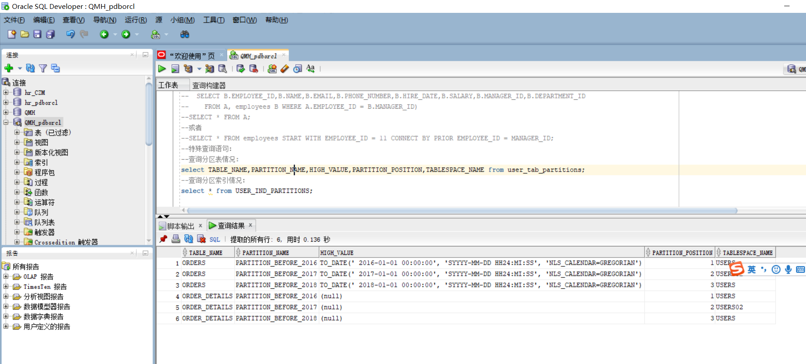
--查询一个分区中的数据
select count(*) from ORDERS partition(PARTITION_BEFORE_2016);
select count(*) from ORDERS partition(PARTITION_BEFORE_2017);
--或者：
--select count(*) from ORDERS where order_date<
--to_date('2016-01-01','yyyy-mm-dd');

select count(*) from ORDER_DETAILS partition(PARTITION_BEFORE_2016);
select count(*) from ORDER_DETAILS partition(PARTITION_BEFORE_2017);
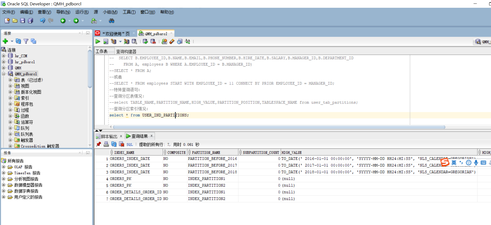
### 收集表的统计信息
--收集表的统计信息dbms_stats.gather_table_stats
--也可以使用ANALYZE TABLE TableName COMPUTE STATISTICS; 但推荐使用dbms_stats.gather_table_stats
--分析单个表：
--exec dbms_stats.gather_table_stats(user,'ORDERS',cascade=>true); --cascade=true表示同时收集索引的信息
--exec dbms_stats.gather_table_stats(user,'ORDER_DETAILS',cascade=>true);
--统计用户的所有表：
exec dbms_stats.gather_schema_stats(User,estimate_percent=>100,cascade=> TRUE); --estimate_percent采样行的百分比

--统计完成后，查询表的统计信息：
select table_name,tablespace_name,num_rows from user_tables where table_name='ORDERS';
select table_name,tablespace_name,num_rows from user_tables where table_name='ORDER_DETAILS';
select * from orders where order_id=1300;
select * from ORDER_DETAILS where order_id=1300;
select * from orders where customer_name='zhang133000';
select * from orders where order_date<to_date('2016-01-01','yyyy-mm-dd');
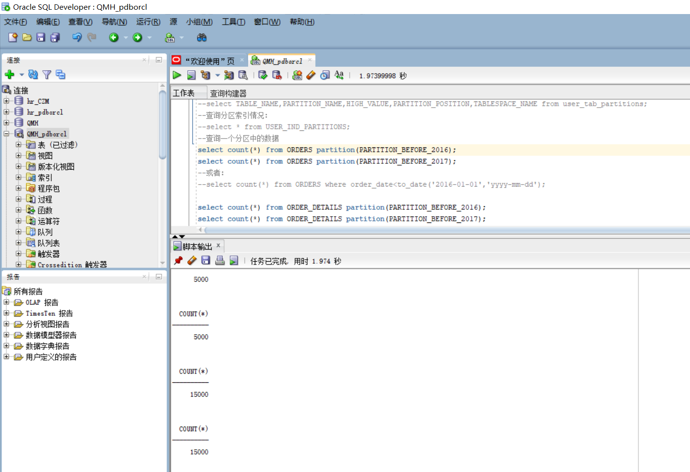

### 查看数据文件的使用情况
select * from dba_data_files;
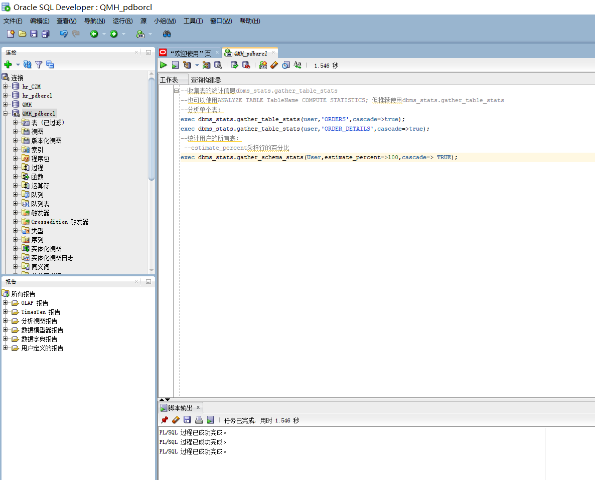
### 查看表空间的使用情况
SELECT a.tablespace_name "表空间名",
total "表空间大小",
free "表空间剩余大小",
(total - free) "表空间使用大小",
total / (1024 * 1024 * 1024) "表空间大小(G)",
free / (1024 * 1024 * 1024) "表空间剩余大小(G)",
(total - free) / (1024 * 1024 * 1024) "表空间使用大小(G)",
round((total - free) / total, 4) * 100 "使用率 %"
FROM (SELECT tablespace_name, SUM(bytes) free
FROM dba_free_space
GROUP BY tablespace_name) a,
(SELECT tablespace_name, SUM(bytes) total
FROM dba_data_files
GROUP BY tablespace_name) b
WHERE a.tablespace_name = b.tablespace_name

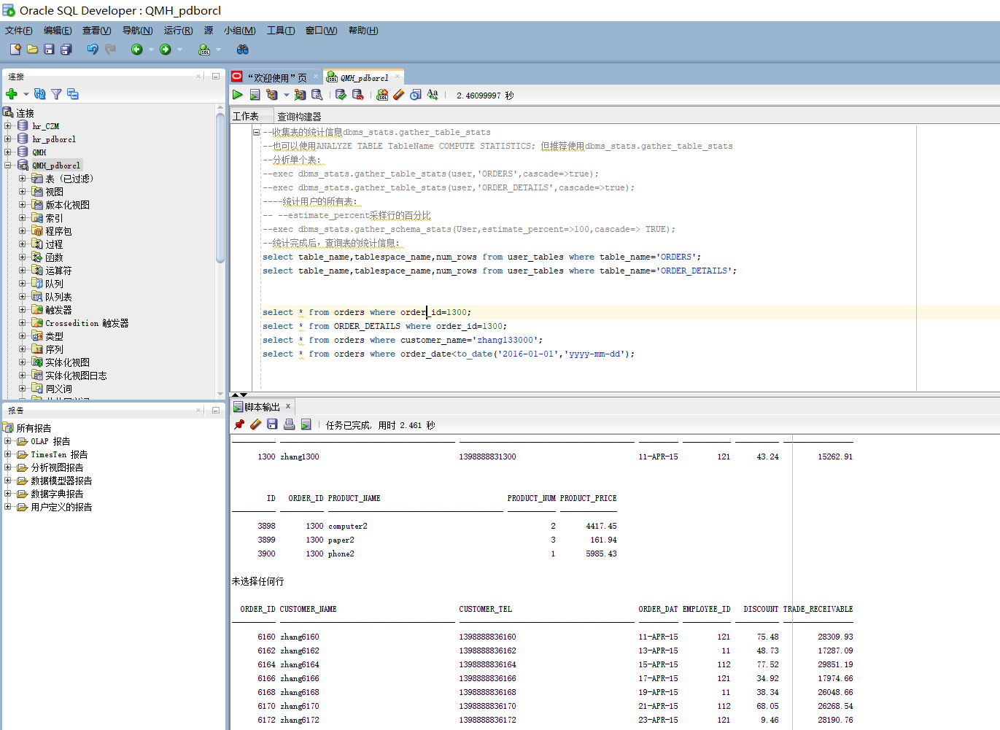
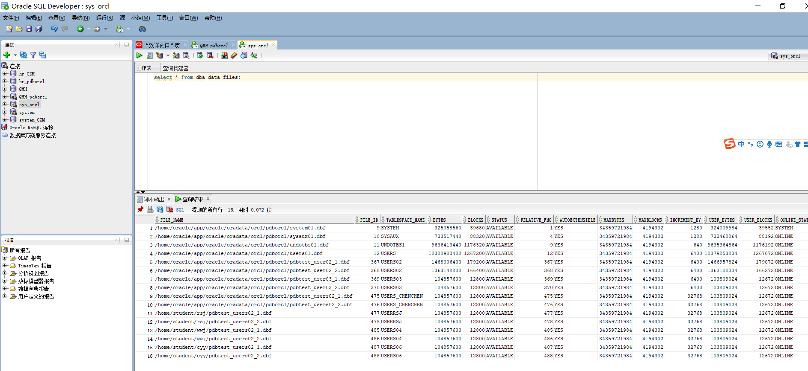
### 查看数据文件大小
[oracle@cdh3 ~]$ ls -lh /home/oracle/app/oracle/oradata/orcl/pdbtest/pdbtest_users*
-rw-r----- 1 oracle root 3.8G 11月  1 14:53 /home/oracle/app/oracle/oradata/orcl/pdbtest/pdbtest_users01_2.dbf
-rw-r----- 1 oracle root 2.4G 11月  1 14:53 /home/oracle/app/oracle/oradata/orcl/pdbtest/pdbtest_users01.dbf
-rw-r----- 1 oracle root 1.5G 11月  1 14:53 /home/oracle/app/oracle/oradata/orcl/pdbtest/pdbtest_users02_1.dbf
-rw-r----- 1 oracle root 2.5G 11月  1 14:53 /home/oracle/app/oracle/oradata/orcl/pdbtest/pdbtest_users02_2.dbf
*/
## 实验注意事项，完成时间： 2021-4-30日前上交

- 请按时完成实验，过时扣分。
- 查询语句及分析文档`必须提交`到：你的Oracle项目中的test4目录中。
- 上交后，通过这个地址应该可以打开你的源码：https://github.com/你的用户名/oracle/tree/master/test4
- 实验分析及结果文档说明书用Markdown格式编写。

## 评分标准

- 实验独立完成，有详细的分析文档，文档中写明自己的用户名。（总分20分）
- 表创建正确（总分30分）
- 分区策略设计正确（总分20分）
- SQL语句正确（总分30分）
