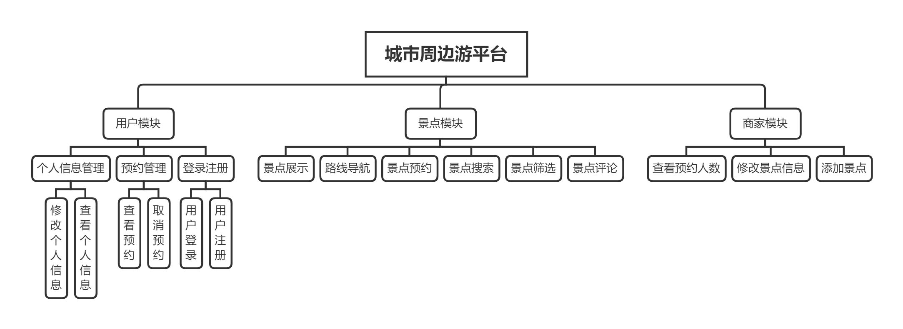

# 基于Oracle的城市周边游平台数据库设计

### 成都大学计算机学院

|     学号     |     班级     |  姓名  |
| :--------: | :--------: | :----: |
| 201810414216 | 软件(本)18-2 | 覃茂辉 |

## 1.概述

- 基于oracle的城市周边游平台设计。前端采用vue+element-ui搭建，后台采用SSM框架+oracle数据库。

- 用户可通过切换城市查看不同城市周边的景点。

- 用户可对距离目的地距离、关键字、评分进行景点搜索。

- 用户可点击查看详情查看景点相关信息和导航路线（百度地图API）。

- 用户登陆后可进行景点预约并在我的预约中查看或取消预约。
- 用户登陆后可对景点进行评论。

- 商户可添加、修改景点信息，查看预约景点的人数。

  

## 2.系统总体结构



## 3.表设计

- ## ADMIN表

|字段|类型|主键，外键|可以为空|默认值|约束|说明|
|:-------:|:-------------:|:------:|:----:|:---:|:----:|:----------|
|ADMIN_ID|NUMBER(8,0)|主键|否| | | 管理员ID |
|ADMIN_NAME|VARCHAR2(50 BYTE)| |否| |  | 管理员用户名 |
|ADMIN_PASSWORD|VARCHAR2(512 BYTE)| |否|123456| | 管理员密码 |

- ## COMMENT表
|字段|类型|主键，外键|可以为空|默认值|约束|说明|
|:-------:|:-------------:|:------:|:----:|:---:|:----:|:----------|
|COMMENT_ID|NUMBER(8,0)|主键|否| | |评论ID|
|PLACE_ID|NUMBER(8,0)| |否| | |评论所对应的景点ID|
|USER_ID|NUMBER(8,0)| |否| | |发布评论的用户ID|
|USERNAME|VARCHAR2(50 BYTE)| |否| | |发布评论的用户名称|
|DATETIME|        DATE        | |否| | |发布评论的时间|
|COMMENTTEXT|VARCHAR2(512 BYTE)| |否| | |评论的内容|

- ## PLACE表
|字段|类型|主键，外键|可以为空|默认值|约束|说明|
|:-------:|:-------------:|:------:|:----:|:---:|:----:|:----------|
|PLACE_ID|NUMBER(18,0)|主键|否| | |景点ID|
|PLACE_TITLE|NUMBER(8,0)| |否| | |景点标题|
|PLACE_DISTANCE|NUMBER(8,0)| |否| | |用户到景点距离|
|PLACE_RATE|VARCHAR2(50 BYTE)| |否| | |景点的评分|
|PLACE_CITY|        DATE        | |否| | |景点所处的城市|
|PLACE_PIC|VARCHAR2(512 BYTE)| |否| | |景点的封面图片地址|
|PLACE_INTRODUCE|VARCHAR2(512 BYTE)| |否| | |景点的描述|
|PLACE_ADDRESS|VARCHAR2(108 BYTE)| |否| | |景点的地址|
|PLACE_PHONE|VARCHAR2(20 BYTE)| |否| | |景点的联系电话|

- ## RESERVATION表
|字段|类型|主键，外键|可以为空|默认值|约束|说明|
|:-------:|:-------------:|:------:|:----:|:---:|:----:|:----------|
|RESERVATION_ID|NUMBER(18,0)|主键|否| | |预约ID|
|RESERVATION_PLACE_ID|NUMBER(8,0)| |否| | |预约景点ID|
|RESERVATION_USER_ID|NUMBER(8,0)| |否| | |预约用户ID|
|RESERVATION_NOW_TIME|DATE| |否| | |发起预约的时间|
|RESERVATION_AIM_TIME|        DATE        | |否| | |预约的时间点|
|RESERVATION_USER_NAME|VARCHAR2(50 BYTE)| |否| | |预约用户的用户名|
|RESERVATION_USER_NUMS|NUMBER(5,0)| |否| | |预约的用户人数|
|RESERVATION_PLACE_NAME|NUMBER(5,0)| |否| | |预约的景点名|

- ## USER表
|字段|类型|主键，外键|可以为空|默认值|约束|说明|
|:-------:|:-------------:|:------:|:----:|:---:|:----:|:----------|
|USER_ID|NUMBER(18,0)|主键|否| | |用户ID|
|USER_PASSWORD|VARCHAR2(48 BYTE)| |否| | |用户密码|
|USER_EMAIL|VARCHAR2(56 BYTE)| |否| | |用户邮箱地址|
|USER_NAME|VARCHAR2(50 BYTE)| |否| | |用户昵称|

## 4.表空间设计

#### 数据存储表空间创建

​	由于需要存储的表数量较多，数据量较大（超过5万条），同时为方便权限管理以及性能考虑，将数据量最多、隐秘性要求最高的的**USER**表、**ADMIN**表放入**MAOHUI01**表空间，将数据量较小的**RESERVATION**表、**PLACE**表、**COMMENT**表放入表空间**MAOHUI02**中，为**MAOHUI01**表空间分配650M空间，为**MAOHUI02**表空间分配350M空间。

SQL语句：

创建表空间MAOHUI01:

​	`create tablespace MAOHUI01 datafile '/home/oracle/app/oracle/oradata/orcl/pdborcl/MAOHUI01.dbf' size 650m AUTOEXTEND ON NEXT 1024M MAXSIZE UNLIMITED;`

创建表空间MAOHUI02:

`	create tablespace MAOHUI02 datafile '/home/oracle/app/oracle/oradata/orcl/pdborcl/MAOHUI01.dbf' size 350m AUTOEXTEND ON NEXT 512M MAXSIZE UNLIMITED;`

#### Undo表空间

​	Undo 类型的表空间，当你对一张表或一条记录进行修改的时候，它会对修改之前的信息进行保存，这样可以保证数据的回滚。Undo 只包含undo类型的对象，不能包含任何其他对象，只适合于数据文件和区间管理。

​	为保证用户数据安全，决定创建Undo表空间用于回滚数据。

创建Undo表空间：

​	`create undo tablespace undo1 datafile '/home/oracle/app/oracle/oradata/orcl/pdborcl/MAOHUIUndo.dbf' size 600m;`

#### Temporary表空间

​	临时表空间，相当于一个临时的垃圾场。用于排序操作，比如你要做一次大数据量的查询，但在内存无法存储这么大量的数据，然后会在磁盘上建立一个临时的表空间用记存放这些数据。Oracle就会用这个临时表空间做排序，存储中间结果。

​	由于数据量较大，为方便快速查询，避免内存不足，决定创建Temprary表空间用户存放临时数据。

创建Temporary表空间：

`create temporary tablespace TEMP datafile '/home/oracle/app/oracle/oradata/orcl/pdborcl/MAOHUITemporary.dbf' size 50m extent management local uniform size 15m;`

## 5.用户管理

#### 创建角色

根据本系统的设计，本系统主要有两种角色，即商家和普通用户。

商家角色可以查询ADMIN表、PLACE表、RESERVATION表、COMMENT表，修改ADMIN表、PLACE表。

普通用户角色可以查询并修改USER表、RESERVATION表、COMMENT表,查询PLACE表。

- 创建商家角色：

  ```sql
  create role admin;
  
  grant create session to admin;
  
  grant select,update on ADMIN to admin;
  
  grant select,update,delete on PLACE to admin;
  
  grant select on RESERVATION to admin;
  
  grant select on COMMENT to admin;
  ```

  

- 创建普通用户角色：

  ```sql
  create role user;
  
  grant create session to user;
  
  grant select,update on USER to user;
  
  grant select,update,delete on RESERVATION to user;
  
  grant select on PLACE to user;
  
  grant select,insert on COMMENT to admin;
  ```
  
  

#### 创建用户

创建user1和admin1分别隶属于user角色和admin角色，并分别存放于表空间MAOHUI01和MAOHUI02，共用同一个Temperary表空间temp存放临时数据。

- 创建user1：

  `create user user1 identified by 123 default tablespace MAOHUI01 temporary tablespace TEMP quota 50M on MAOHUI01；`

  `grant user to user1;`

- 创建admin1：

  `create user admin1 identified by 123 default tablespace MAOHUI02 temporary tablespace TEMP quota 50M on MAOHUI02；`

  `grant admin to admin1;`

## 6.PL/SQL设计

#### 创建包定义

```sql
CREATE OR REPLACE PACKAGE  MAOHUI_PKG
IS
  --商家登录
  FUNCTION admin_login(
           username    VARCHAR2, 
           password VARCHAR2)
  RETURN NUMBER;
  --通过id查找商家账号
  PROCEDURE admin_findById(admin_id IN NUMBER,admin OUT ADMIN%rowtype);
  --修改商家账号信息
  FUNCTION admin_update(
           username    VARCHAR2, 
           password VARCHAR2,
  		   admin_id NUMBER)
  RETURN NUMBER;
  --添加景点
  FUNCTION place_insert(
           place_title    VARCHAR2, 
           place_distance NUMBER,
  		   place_rate NUMBER,
           place_city    VARCHAR2, 
           place_pic VARCHAR2)
  RETURN NUMBER;
  --按城市查找景点
  PROCEDURE place_findByCity(
      city IN VARCHAR2,
      places OUT PLACE%rowtype);
  --按关键字、评分、距离、城市查找景点
  PROCEDURE place_search(
      city IN VARCHAR2,
      rate IN NUMBER,
      distance IN VARCHAR2,
      keywords IN VARCHAR2,
      places OUT PLACE%rowtype);
  --按id查找评论
  PROCEDURE place_search(
      comment_id IN NUMBER,
      comment OUT COMMENT%rowtype);
  --用户登录
  FUNCTION user_login(
           username    VARCHAR2, 
           password VARCHAR2)
  RETURN NUMBER;
  --修改用户信息
  FUNCTION user_update(
           username    VARCHAR2, 
           password VARCHAR2,
  		   user_id NUMBER)
  RETURN NUMBER;
  --通过用户id查找用户
  PROCEDURE user_findById(user_id IN NUMBER,user OUT USER%rowtype);
  --添加用户预约
  FUNCTION reservation_insert(
           reservation_place_id NUMBER,
           reservation_user_id NUMBER,
           reservation_nums NUMBER,
           reservation_now_time    DATE, 
           reservation_aim_time    DATE, 
           reservation_user_name    VARCHAR2, 
           reservation_place_title VARCHAR2)
  RETURN NUMBER;
  --取消预约
  FUNCTION delete_reservation(reservation_id NUMBER)
  RETURN NUMBER;
END MAOHUI_PKG;
```

#### 创建包主体

```sql
create or replace package body MAOHUI_PKG
is
	--商家登录
	function admin_login(
           username    VARCHAR2, 
           password VARCHAR2)
    return number is
    num number(7,2);
    begin
    select count(*) into num from ADMIN where ADMIN_NAME=username and ADMIN_PASSWORD=password;
    return num;
    end;
    
    --通过id查找商家账号
    PROCEDURE admin_findById(
        admin_id IN NUMBER,
        admin OUT ADMIN%rowtype)
    is
    BEGIN
    	select * into admin from ADMIN where ADMIN_ID=admin_id;
    end;
    
    --修改商家账号信息
    FUNCTION admin_update(
           username    VARCHAR2, 
           password VARCHAR2,
  		   admin_id NUMBER)
    RETURN NUMBER is
    num number(7,2);
    begin
    	num:= update ADMIN set ADMIN_NAME=username,ADMIN_PASSWORD=password where ADMIN_ID=admin_id;
    end;
    
    --添加景点
    FUNCTION place_insert(
           place_title    VARCHAR2, 
           place_distance NUMBER,
  		   place_rate NUMBER,
           place_city    VARCHAR2, 
           place_pic VARCHAR2)
    RETURN NUMBER is
    num number(7,2);
    begin
    	num:= insert into PLACE(PLACE_TITLE,PLACE_DISTANCE,PLACE_RATE,PLACE_CITY,PLACE_PIC) values  (place_title,place_distance,place_rate,place_city,place_pic);
    end;
    
    --按城市查找景点
    PROCEDURE place_findByCity(
           city IN VARCHAR2,
           places OUT PLACE%rowtype)
    is
    I BINARY_INTEGER := 0;
    BEGIN
    	FOR place IN ( select * from PLACE where PLACE_CITY=city; ) LOOP
      	places(i) := place;
      	I := I + 1;
    	END LOOP;
    end;
    
    --按关键字、评分、距离、城市查找景点
    PROCEDURE place_search(
          city IN VARCHAR2,
          rate IN NUMBER,
          distance IN VARCHAR2,
          keywords IN VARCHAR2,
          places OUT PLACE%rowtype)
    is
    I BINARY_INTEGER := 0;
    BEGIN
    	FOR place IN ( select * from PLACE where PLACE_CITY=city and PLACE_RATE&gt;=rate and 		  PLACE_DISTANCE&lt;=distance and locate(keyword,PLACE_TITLE); ) LOOP
      	places(i) := place;
      	I := I + 1;
    	END LOOP;
    end;
    
    --按id查找评论
    PROCEDURE place_search(
      comment_id IN NUMBER,
      comment OUT COMMENT%rowtype) IS
    is
    BEGIN
    	select * into comment from COMMENT where COMMENT_ID=comment_id;
    end;
    
    --用户登录
    FUNCTION user_login(
           username    VARCHAR2, 
           password VARCHAR2)
    RETURN NUMBER is
    num number(7,2);
    begin
    select count(*) into num from USER where USER_NAME=username and USER_PASSWORD=password;
    return num;
    end;
    
    --修改用户信息
    FUNCTION user_update(
           username    VARCHAR2, 
           password VARCHAR2,
  		   user_id NUMBER)
    RETURN NUMBER is
    num number(7,2);
    begin
    	num:= update USER set USER_NAME=username,USER_PASSWORD=password where USER_ID=user_id;
    end;
    
    --通过用户id查找用户
    PROCEDURE user_findById(
        user_id IN NUMBER,
        user OUT USER%rowtype)
    is
    BEGIN
    	select * into user from USER where USER_ID=user_id;
    end;
    
    --添加用户预约
    FUNCTION reservation_insert(
           reservation_place_id NUMBER,
           reservation_user_id NUMBER,
           reservation_nums NUMBER,
           reservation_now_time    DATE, 
           reservation_aim_time    DATE, 
           reservation_user_name    VARCHAR2, 
           reservation_place_title VARCHAR2)
    RETURN NUMBER is
    num NUMBER(7,2);
    BEGIN
    num := insert into RESERVATION(RESERVATION_PLACE_ID,RESERVATION_USER_ID,RESERVATION_NOW_TIME,RESERVATION_AIM_TIME,RESERVATION_USER_NAME,RESERVATION_USER_NUMS,RESERVATION_PLACE_NAME) values (reservation_place_id,reservation_user_id,reservation_now_time,reservation_aim_time,reservation_user_name,reservation_nums,reservation_place_title);
    END;
    
    --取消预约
    FUNCTION delete_reservation(reservation_id NUMBER)
    RETURN NUMBER is
    num NUMBER(7,2);
    BEGIN
    num := delete from RESERVATION where RESERVATION_ID=reservation_id;
    END;
    
end;
```


## 7.备份方案

#### 备份数据库的三种方法

- 冷备份

- 热备份

- 物理备份

  由于本系统非关键应用系统，无需24小时不间断运行，考虑到冷备份简单易操作的特性，本系统拟采用冷备份的方式进行备份。

#### 冷备份

(1) 关闭数据库

`shutdown immediate；`

(2) 复制文件

​	1）复制三个文件夹

​	admin；

​	oradata(datafile， controlfile，redo)；

​	flash_recovery_area三个文件夹。

​	2）dbhome_1下的内容

​	database(PWDfile、pfile)；

​	dbs(spfile)；

​	NETWORK/ADMIN(listener.ora、tnsnames.ora)。

(3) 恢复数据库

​	1）创建一个和原来一样的数据库。(安装路径和数据库名必须和原来一致)

​	2）停止数据库shutdown immediate；
​	3）复制安装目录下的admin、oradata、flash_recovery_area覆盖，复制database(PWDfile、pfile) 覆盖
​	4）启动数据库 startup;

备注：

无归档模式：将备份文件拷贝回原来的目录即可，然后启动数据库。
归档模式：
	①将数据文件、控制文件拷贝回原来目录
	②SQL>startup mount;
	SQL>recover database using backup controlfile;
	③将相应的归档日志和联机日志拖到CMD命令窗口进行跑日志。
	④SQL>alter database open resetlogs;


